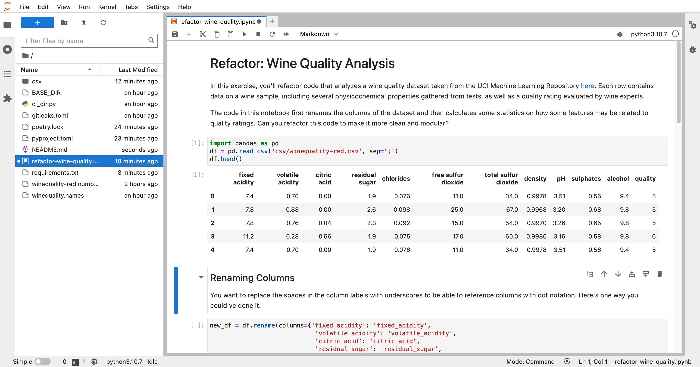

# wine_quality



## Summary
Udacity course on data science.

**Table of Contents**
* [wine_quality](#wine_quality)
  * [Summary](#summary)
  * [Setup](#setup)
  * [Usage](#usage)
    * [Poetry](#poetry)
    * [Docker](#docker)
    * [Both](#both)
  * [TODO](#todo)
  * [Further Reading](#further-reading)

## Setup
* Install
    * [editorconfig](https://editorconfig.org/)
    * [asdf](https://asdf-vm.com/guide/getting-started.html#_2-download-asdf)
    * [poetry](https://python-poetry.org/docs/)
    * [docker](https://docs.docker.com/compose/install/)
* Download CSVs from [here](https://archive.ics.uci.edu/ml/machine-learning-databases/wine-quality/)
  * Move to `csv` directory

## Usage
### Poetry
* Install requirements via Poetry: 
    ```bash
    poetry install
    poetry run ipython kernel install --name "python3.10.7" --user
    ```
* Run Jupyter Lab
    ```bash
    poetry shell
    jupyter lab --ip=0.0.0.0 --port=8888 --no-browser
    ```
* Quit the server via `ctrl-c` in the terminal
* Enter `deactivate` to exit the Poetry virtual environment

### Docker
* Customize the `.env.example` and rename to `.env`
* General commands
    ```bash
    # build image locally
    docker-compose build --pull --no-cache

    # start container
    docker-compose up -d

    # stop container
    docker-compose stop

    # remove container and network
    docker-compose down
    ```
* `justfile` syntax (recommended)
    ```bash
    # help
    just

    # build image locally (no-cache)
    just build-clean

    # build image locally
    just build

    # start container
    just start

    # ssh
    just exec

    # stop container
    just stop

    # stop container, remove container and network
    just down
    ```

### Both
* Open a browser and navigate to `http://127.0.0.1:8888`
  * Docker uses the token specified in `.env`
* Select the "python3.10.7" kernel if asked
* Open `refactor-wine-quality.ipynb` from the left-hand column
* Run cells by selecting them and pressing `shift-enter`

## TODO
* ~~Get Jupyter working in [VSCode](https://github.com/microsoft/vscode-jupyter)~~
  * Multiple `localhost` entries in `/etc/hosts` 😭

## Further Reading
[Original Repo](https://github.com/pythoninthegrass/wine_quality)

[Starting JupyterLab](https://jupyterlab.readthedocs.io/en/stable/getting_started/starting.html)

[Jupyter Docker Stacks — Docker Stacks documentation](https://jupyter-docker-stacks.readthedocs.io/en/latest/index.html)

[Dockerizing Jupyter Projects](https://towardsdatascience.com/dockerizing-jupyter-projects-39aad547484a)
