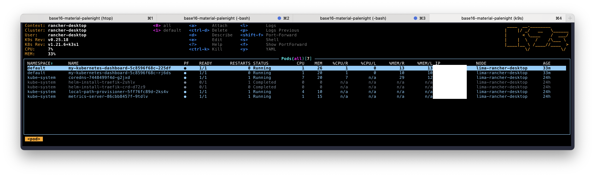
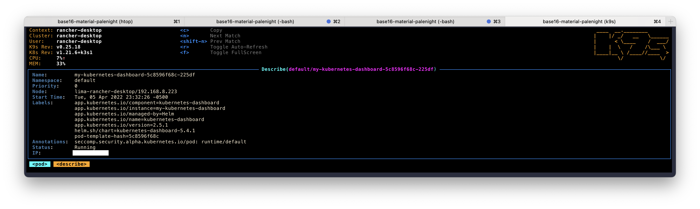
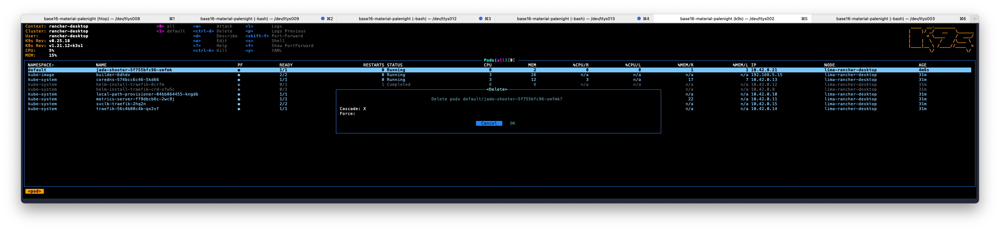
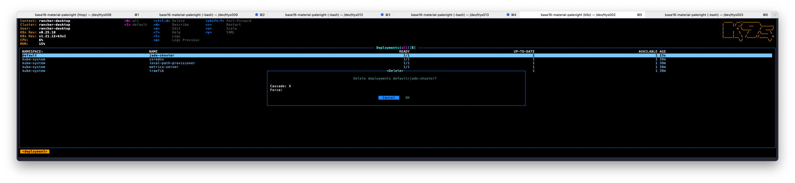

### Kubernetes (k8s)

* Easiest way to set up a local single node cluster is via one of the following:
    * [Rancher Desktop](https://docs.rancherdesktop.io/getting-started/installation)
    * [minikube](https://minikube.sigs.k8s.io/docs/start/)
      * Incidentally, `minikube` ships with the Kubernetes Dashboard
        ```bash
        minikube dashboard
        ```
      * The boilerplate [Terraform plan](#terraform) below hasn't been tested against `minikube`
    * [multipass](https://multipass.run/) with [microk8s](https://ubuntu.com/tutorials/getting-started-with-kubernetes-ha#1-overview)
* Add aliases to `~/.bashrc` or `~/.zshrc`
    ```bash
    # k8s
    alias k="kubectl"
    alias kc="kubectl config use-context"
    alias kns='kubectl config set-context --current --namespace'
    alias kgns="kubectl config view --minify --output 'jsonpath={..namespace}' | xargs printf '%s\n'"
    KUBECONFIG="$HOME/.kube/config:$HOME/.kube/kubeconfig:$HOME/.kube/k3s.yaml"
    ```
* CLI/TUI (terminal user interface) management of k8s
  * [k9s](https://github.com/derailed/k9s#installation)
    * Built-in help: type `?`
    * Main Screen: `:pod`
    
    * Describe a pod: `d`
    
    * Delete a pod:
      * `ctrl-d`
      * Replicas rebuild
    
    * Remove resource (permanent)
      * `:deploy`
      * `ctrl-d`
    
* [POC](https://itnext.io/simplest-minimal-k8s-app-tutorial-with-rancher-desktop-in-5-min-5481edb9a4a5)
  ```bash
  git clone https://github.com/jwsy/simplest-k8s.git
  k config get-contexts                    # should have `rancher-desktop` selected
  kc rancher-desktop                       # switch to rancher context if not
  k create namespace simplest-k8s
  k apply -n simplest-k8s -f simplest-k8s
  k delete -n simplest-k8s -f simplest-k8s
  k delete namespace simplest-k8s
  ```
  * Navigate to https://jade-shooter.rancher.localhost/ in Chrome
  * Allow self-signed cert
  * Profit 💸
