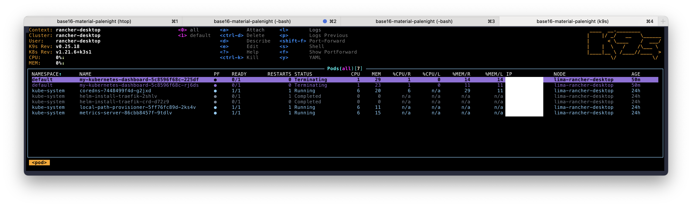

### Terraform

* **NOTES**:
  * This section depends on Kubernetes and a `~/.kubeconfig` from [above](#kubernetes-k8s)
  * `NodePort` was used instead of `LoadBalancer` for `service.type`
    * [MetalLB is a stretch goal](https://stackoverflow.com/a/71047314) for future deployments
* Install `terraform` via `asdf
    ```bash
    # terraform
    asdf plugin-add terraform
    asdf install terraform latest
    ```
* Add aliases to `~/.bashrc` or `~/.zshrc`
    ```bash
    # ~/.bashrc
    alias tf='terraform'
    alias tfi='terraform init -backend-config=./state.conf'
    alias tfa='terraform apply'
    alias tfp='terraform plan'
    alias tfpn='terraform plan -refresh=false'
    ```
* Navigate to `./terraform/` and [initialize](https://www.terraform.io/cli/commands/init) the `terraform` working directory
    ```bash
    cd terraform/
    tfi
    ```
* Create an [execution plan](https://www.terraform.io/cli/commands/plan)
    ```bash
    tfp
    ```
* [Apply/execute the actions](https://www.terraform.io/cli/commands/apply) from Terraform plan
    ```bash
    tfa
    ```
* Navigate to `http://localhost:<port>`
  * Port can be found via `kubectl`
    ```bash
    k get svc   # 80:31942/TCP
    ```
* [Tear down deployment](https://www.terraform.io/cli/commands/destroy)
    ```bash
    tf destroy
    ```
  * Real-time view of pod removal
    

#### Debugging
* [Verbose logging](https://www.terraform.io/cli/config/environment-variables) and redirection to a file
    ```bash
    export TF_LOG="trace"                       # unset via "off"
    export TF_LOG_PATH="$HOME/Downloads/tf.log" # `~` doesn't expand
    ```
    * [Log levels](https://www.terraform.io/internals/debugging)
      * TRACE
      * DEBUG
      * INFO
      * WARN
      * ERROR
* `Error: cannot re-use a name that is still in use`
    > I think I resolved the issue. This is what I did: 1) mv the terraform.tfstate to another name, 2) mv the terraform.tfstate.backup to terraform.tfstate, and 3) run 'terraform refresh' command to confirm the state is synchronized, and 4) run 'terraform apply' to delete/create the resource. I will mark your reply as the answer, as it gives me the clue for solving the issue. Thanks! – ozmhsh Dec 9, 2021 at 4:57

    [nginx - Stuck in the partial helm release on Terraform to Kubernetes - Stack Overflow](https://stackoverflow.com/questions/70281363/stuck-in-the-partial-helm-release-on-terraform-to-kubernetes#comment124244564_70281451)
